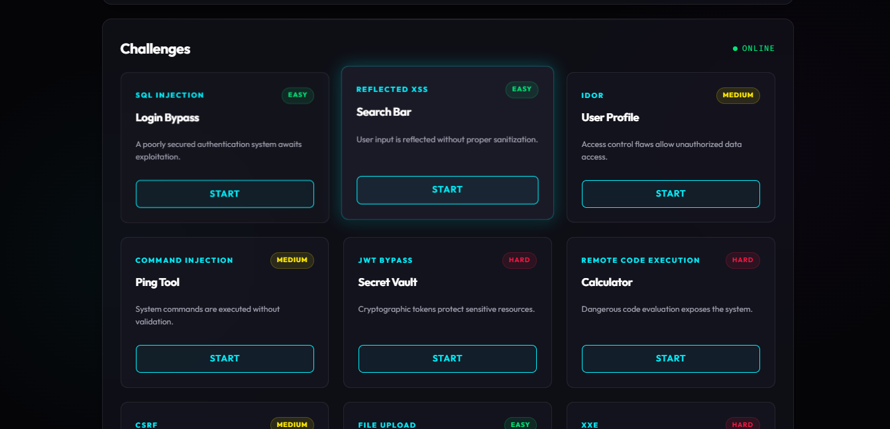
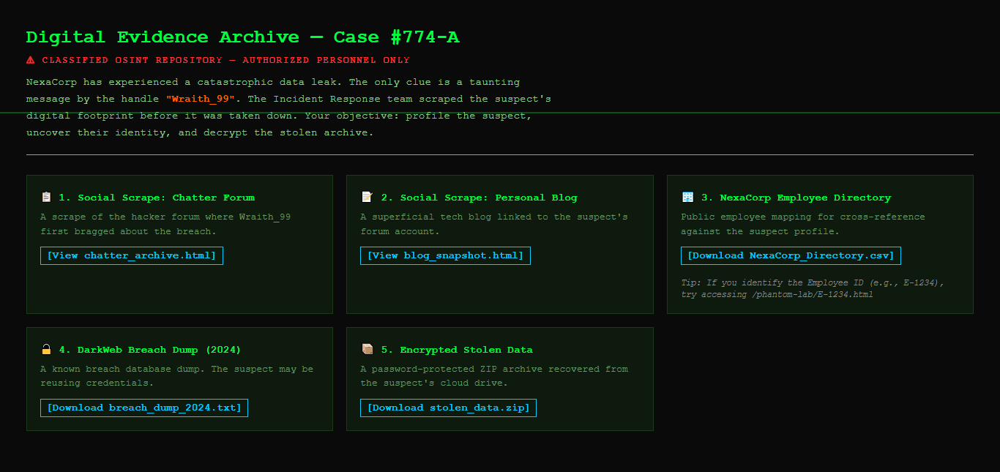
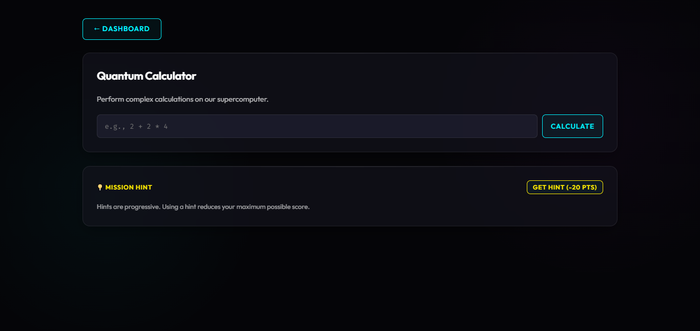

# AquilaCyber Defenders Portal

A self-hosted cybersecurity training portal built by **AquilaCyber** for university Defenders chapters across Africa. Run 13 intentionally vulnerable web security challenges, compete in teams, and host timed events with a live leaderboard.


> **Security warning:** This portal contains intentionally vulnerable code for educational purposes. Deploy only on private networks or isolated environments. See [SECURITY.md](SECURITY.md).

---

## Screenshots

### Dashboard
The main hub — challenge grid with sub-flag progress, live score breakdown, flag submission, and event status banner.



### Phantom Insider — OSINT Lab
Multi-stage corporate insider threat investigation with digital evidence analysis.



### Calculator RCE Lab
Exploit dangerous code evaluation in a sandboxed environment.




## Quick Start

### Docker (Recommended)

```bash
git clone https://github.com/AquilaCyber/CTF-Master.git
cd CTF-Master
cp .env.example .env          # set SESSION_SECRET and JWT_SECRET
node scripts/create-admin.js yourpassword
docker compose up --build
```

Open **http://localhost:3000** and log in as `admin`.

```bash
docker compose down        # stop
docker compose down -v     # stop + wipe all data
```

### Local

```bash
npm install
cp .env.example .env
node scripts/create-admin.js yourpassword
npm start
```

### Development (hot-reload)

```bash
docker compose -f docker-compose.dev.yml up --build
# or: npm run dev
```

---

## Admin Account

Run this **before** starting the server. If the server is already running, restart it afterward.

```bash
node scripts/create-admin.js yourpassword

# Docker (restart required after)
docker exec -it aquila-ctf node scripts/create-admin.js yourpassword
docker compose restart
```

Log in at `/auth/login` with username `admin`. The admin link appears in the sidebar.

---

## Challenges

### Web Security Labs

| # | Lab | Type | Difficulty |
|---|-----|------|-----------|
| 1 | Login Bypass | SQL Injection | Easy |
| 2 | XSS Search | Reflected XSS | Easy |
| 3 | User Profile | IDOR | Medium |
| 4 | Ping Tool | Command Injection | Medium |
| 5 | Secret Vault | JWT Bypass | Hard |
| 6 | Calculator | Remote Code Execution | Hard |
| 7 | Settings Panel | CSRF | Medium |
| 8 | File Manager | File Upload | Easy |
| 9 | XML Parser | XXE | Hard |
| 10 | URL Fetcher | SSRF | Medium |

### Phantom Insider — OSINT Lab

| # | Sub-Flag | Goal |
|---|----------|------|
| 11 | Identity Resolution | Identify the insider from digital evidence |
| 12 | Geo-Location Intel | Extract EXIF metadata from recovered media |
| 13 | Data Decryption | Crack credentials and decrypt the stolen archive |

### Scoring

- 100 points per flag — 1,300 points maximum
- −20 points per hint (3 hints per challenge)
- Team scoring: one solve per challenge per team, earliest member counts

---

## Team Mode

Choose at registration — Solo, Create Team, or Join Team with a 6-character code. Only one teammate needs to solve each challenge for the team to score. Individual and team leaderboards are separate tabs.

---

## Event System

Configure from **Admin Panel → Event tab** — no restart needed.

| Setting | Effect |
|---------|--------|
| Start Time | Submissions blocked until this time |
| End Time | Submissions close |
| Freeze Time | Leaderboard locks (solves still count for final score) |

Quick presets (1h / 2h / 4h / 8h) auto-set a 15-minute freeze before the end.

---

## Environment Variables

| Variable | Description |
|----------|-------------|
| `SESSION_SECRET` | Session signing key — **change this** |
| `JWT_SECRET` | JWT key for Vault challenge |
| `PORT` | Server port (default `3000`) |
| `DB_PATH` | Database file path (default `./aquila.json`) |

Event timing is set in the Admin Panel, not via environment variables.

---

## Troubleshooting

**Can't log in as admin** — the create-admin script writes to disk but a running server won't see it. Restart the server after running the script.

**Database corrupted** — delete `aquila.json` and restart. The server re-seeds automatically.

**OSINT lab images missing** — run `node phantom-insider/generate.js` (requires `npm install`).

**Flag files missing** — restart the server. It generates `flag_calc.txt`, `flag_xxe.txt`, and `ping_sandbox/flag_ping.txt` from the database on startup.

**Clean before pushing** — run `bash scripts/clean-dev.sh` to remove dev data, uploads, and generated files.

---

## Contributing & Security

See [CONTRIBUTING.md](CONTRIBUTING.md) and [SECURITY.md](SECURITY.md).

---

## Community

Built for and by the **AquilaCyber Defenders** — Africa's cybersecurity talent pipeline.

- [alturacyber.com/aquilacyber](https://alturacyber.com/aquilacyber)
- [@aquila\_cyber](https://twitter.com/aquila_cyber)
- support@aquilacyber.com

---

MIT License — educational use only.