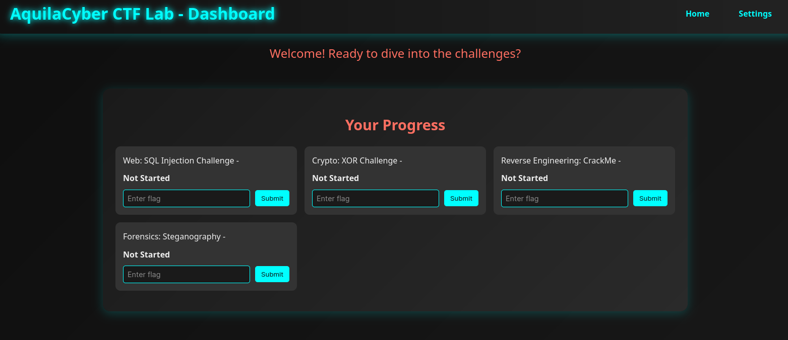
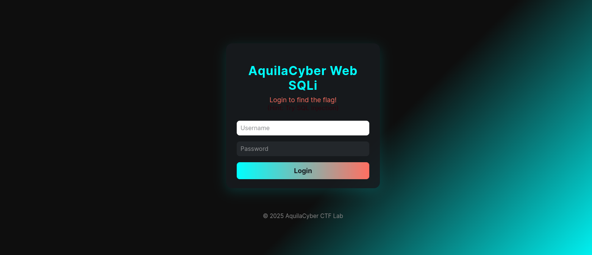
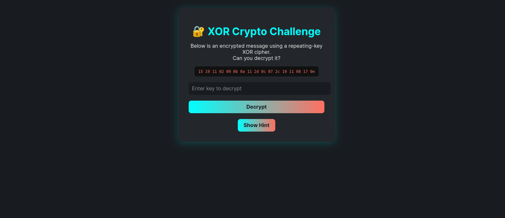

# 🦅 AquilaCyber CTF Lab 🦅

Welcome to the **AquilaCyber CTF Lab** — your all-in-one playground for learning, hacking, and having fun! Step into the shoes of a digital detective, a cryptanalyst, a reverse engineer, and a forensics wizard. Each challenge is crafted to teach, surprise, and entertain. Whether you’re a beginner or a seasoned hacker, you’ll find something to test your skills and spark your curiosity.

> **"The best way to learn cybersecurity is to break things — and then fix them!"**


## 🚩 What’s Inside?

You’ll tackle four unique, hands-on challenges:

- **Web Security (SQL Injection):** Hack your way past login forms and extract secrets from a vulnerable web app. Learn the art of SQLi in a safe, legal environment.
- **Cryptography (XOR):** Can you outsmart a classic XOR cipher? Solve riddles, analyze ciphertext, and discover the flag — all in a beautiful web interface.
- **Reverse Engineering (CrackMe):** Dive into Python bytecode and .pyc files. Reverse engineer the logic, break the obfuscation, and claim your flag!
- **Forensics (Steganography):** Download a mysterious image, use your favorite stego tools, and reveal the flag hidden in the pixels. No upload needed — just pure analysis.

Each challenge is web-based, visually modern, and comes with hints and narrative to guide you.


## 🚀 Getting Started

### Prerequisites

Before you begin, make sure you have the following installed:

- **Docker Desktop** (for easy management of containers)
- **Docker Compose** (usually included with Docker Desktop)

That's it! The entire lab environment is containerized, so you don't need to worry about local dependencies like PHP or Python.

### 🛠️ Installation & Launch

1.  **Clone the repository (if you haven't already):**
    ```bash
    git clone <repository_url>
    cd aquilacyber_ctf_lab
    ```

2.  **Run the setup script:**
    ```bash
    ./setup.sh
    ```
    This command will build the Docker images for each challenge and start all the services in the background.

### 🌐 Accessing the Lab

Once the script is finished, the entire CTF lab is up and running.

-   **Main Dashboard:** [http://localhost:8000/index.php](http://localhost:8000/index.php)

    Start here to see all the available challenges. The dashboard provides links to each individual challenge and a progress tracker where you can input flags.

-   **Screenshots:** Check the `screenshots/` directory for images of the dashboard and some of the challenge interfaces.

    
    
    
 

-   **Direct Challenge Links:**
    -   **Web SQLi:** [http://localhost:5001](http://localhost:5001)
    -   **Crypto XOR:** [http://localhost:5002](http://localhost:5002)
    -   **Forensics Stego:** [http://localhost:5004](http://localhost:5004)
    -   **Reverse PYC:** This is a command-line challenge. To access it, you'll need to enter the running container. You can do this by running `docker exec -it <container_id> /bin/bash` and then running `python crackme.py`.

To stop the lab, run `docker-compose down`.


## 💡 Tips for Success

- 🔎 **Explore everything:** Inspect source code, try edge cases, and don’t be afraid to break things.
- 🧩 **Use the hints:** Each challenge has built-in hints or riddles. If you’re stuck, look for clues!
- 🛠️ **Try different tools:** For stego, use zsteg, stegsolve, or online LSB tools. For reversing, try pycdc, uncompyle6, or just a hex editor.
- 🧠 **Think like an attacker:** What would a real hacker do? Try SQL injection payloads, brute force, or code analysis.
- 💬 **Ask for help:** Stuck? Collaborate with friends or search online. Learning is the goal!
- 🎉 **Have fun:** The best hackers are the ones who enjoy the puzzle.
- 🏁 **Flag Format:** All flags are in the format `flag{...}`. Use the progress tracker on the dashboard to input and verify your flags.


## 🤝 Contributing

Want to add your own challenge, improve the UI, or make the lab even more fun? Fork the repo, open a pull request, or suggest ideas. All contributions are welcome!


## 📜 License & Disclaimer

This project is for educational and ethical hacking purposes only. Please use responsibly and do not attack systems you do not own or have permission to test.


---

Happy hacking, and may the flags be ever in your favor! 🦅🔥
